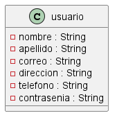

# Control de actividades.

## **Descripcion:** Proyecto para controlar las actividades de una persona. 

## **Requerimientos funcionales**

**RF1:** Gestionar la CRUD en el proceso de los usuarios. 
- **Descripción:** Se requiere adminsitrar la CRUD para controlar de manera adecuada los datos correspondientes a los usuarios del sistema.
- **Entrada de datos:** 
    - Nombre
    - Apellido
    - Correo
    - Dirección
    - Teléfono
    - Contraseña
- **Flujo normal:** 
    - Acceder a la url del sistema de información
    - Autenticarse como usario registrado
        - Actualizar los datos del perfil
        - Gestionar activades
    - Registrarse como usuario nuevo 
        - Diligenciar los datos solicitado por el sistema `Nombre`, `Apellido`, `Correo`, `Dirección`, `Teléfono` y `Contraseña`
        - Gestionar activades
- **Precondiciones:** 
    - Disponibilidad del sistema de información
    - Acceso internet/intranet
- **Poscondiciones:** 
    1. Acceder al sistema
        - Datos de entrada por parte del usuario no son válidos, por lo tanto, se solicita ingresar de nuevo los datos, luego de validar que el usuario está activo. Se informa, `Datos de autenticación no son válidos`
        - Datos de entrada por parte del usuario son válidos, sin embargo, luego de validar que el usuario está inactivo. `Usuario se encuentra inhabilitado para acceder al sistema`
        - Datos de entrada por parte del usuario no son válidos, luego de validar que el usuario no existe. `Usuario no se encuentra registrado`
        - Datos de registro para el usario ya existen en el sistema. `xyz`
- **Restricciones de campos:**
- **Interfaces**
- **Diagrama caso de uso:**
- **Diagrama de clase**

    

**RF2:** Gestionar la CRUD en el proceso de los actividades. 
- **Diagrama de clase**

    

===========================

**Diagrama del sistema**

- **Diagrama de clase**

    

## **Requerimientos no funcionales**

## **Abreviaturas**

1. **CRUD:** Crear, Modificar, Eliminar y Consultar datos. 